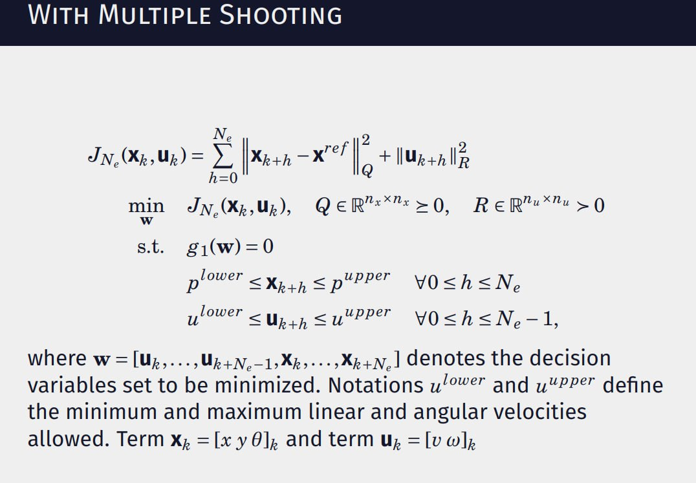
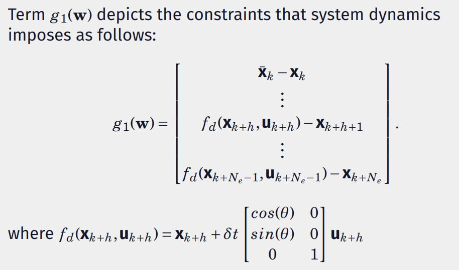

# MPC-based tracking control for Diff-drive robot controller 
## Follow the instruction how to install husky robot http://wiki.ros.org/husky_navigation/Tutorials/Husky%20Move%20Base%20Demo
## Problem formulation 

  
 

## How it works? 
https://youtu.be/daIc8zHEQcQ
 

